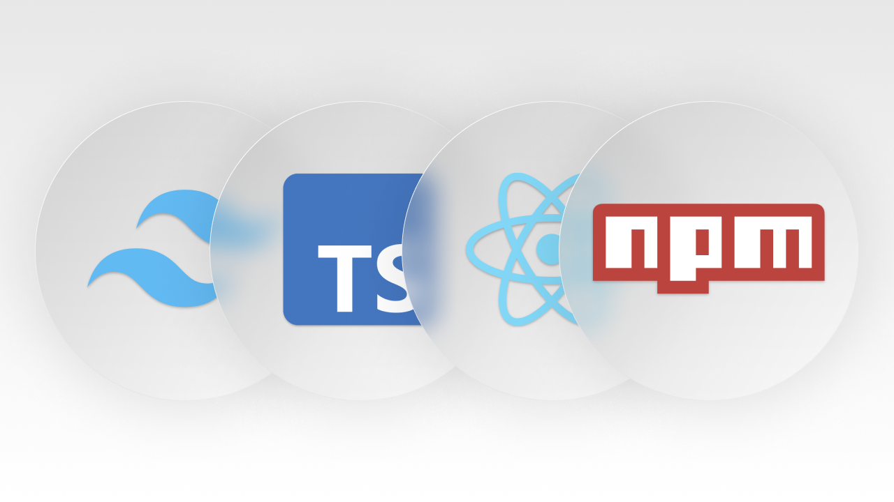

Hello, this is my **first markdown**, and I will be writing a lot of articles in here now that I have this pretty template.



## This is a H2 heading
But I also have access to all sorts of markdown features like *italics*, ~strikethrough~, lists, `inline code`, and code blocks.

1. hello
2. i'm
3. a
4. list

```html
<div>
    <p>hello</p>
</div>
```

Remember the default styling is removed by tailwind, so if anything isn't styled make sure to add it in the `base.css`. Which we do in the course.